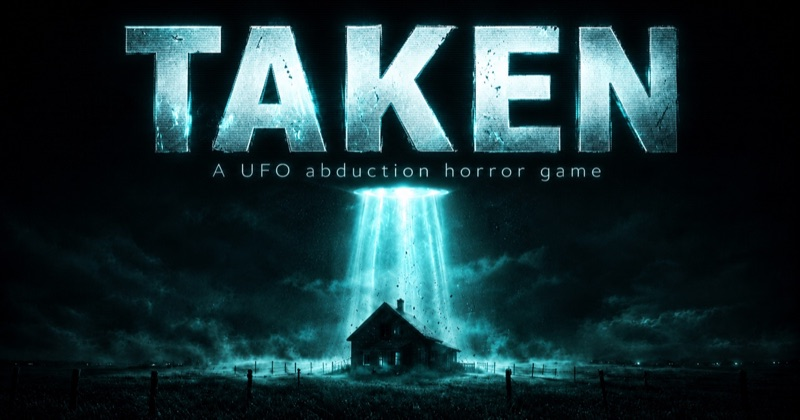
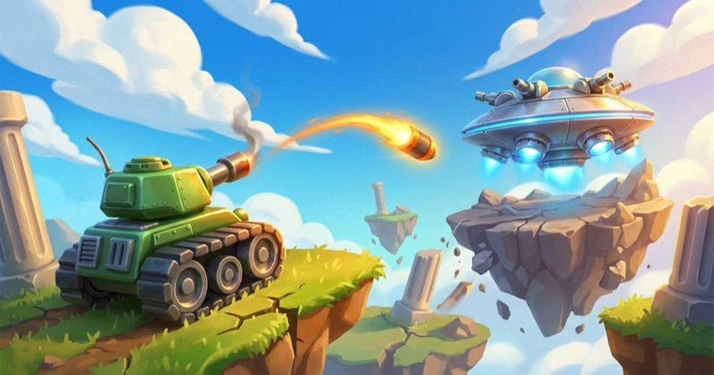
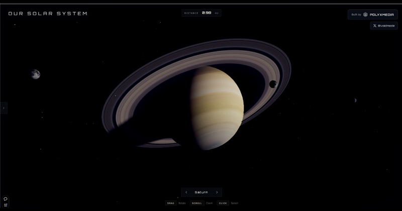
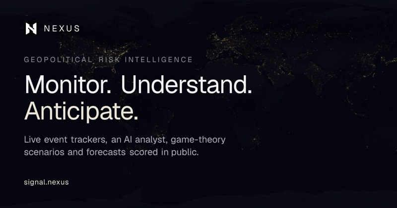
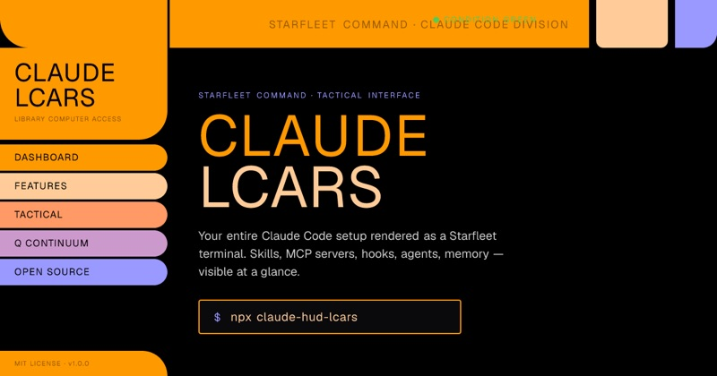

<!-- The banner is generated, edit scripts/hero.py and re-run it rather than touching assets/hero.svg -->

  

  
  
  
  
  

 

I've been shipping software for over 20 years for the likes of Coca-Cola and Warner Bros, everything from event-driven systems that chew through 7 billion events a year to the ticketing platform behind T.I.'s Trap Music Museum. By day I'm a Principal Engineer at [Eagle Eye](https://eagleeye.com), building the APIs major retailers run their loyalty and promotions on.

The rest of the time I'm making browser games in Three.js, building tools for AI coding agents, and running a research project into what reality is actually made of... which is a strange sentence to put in a GitHub bio, but here we are.

 

## Games you can play right now

All free, all in the browser, nothing to install. I build them from scratch, mostly on Three.js, because I like knowing where every pixel comes from.

<table>
  <tr>
    <td width="50%" valign="top">
      
      <h3><a href="https://taken-game.com">TAKEN</a></h3>
      A first-person UFO horror game on an isolated Montana farm. You work the land by day and survive whatever comes down out of the sky at night, and it's all slow-burn dread with very few cheap jump scares.
        Three.js · WebAudio · first-person horror
    </td>
    <td width="50%" valign="top">
      
      <h3><a href="https://www.velocity-gp.com">Velocity GP</a></h3>
      Anti-gravity racing in the Wipeout tradition. There's a freshly generated circuit every day, a full league campaign, and ghost times so you can race your friends without them being online.
        Three.js · procedural tracks · daily challenge
    </td>
  </tr>
  <tr>
    <td width="50%" valign="top">
      
      <h3><a href="https://shellbound-game.com">Shellbound</a></h3>
      A turn-based artillery duel in the Scorched Earth and Worms tradition. Pick a tank, a dragon or a UFO, read the wind, and blast the other side off destructible terrain against the CPU, a friend on the same couch, or online.
        JavaScript · destructible terrain · online multiplayer
    </td>
    <td width="50%" valign="top">
      
      <h3><a href="https://3dsolarsystem.online/viewer/#earth">Our Solar System</a></h3>
      A cinematic, photoreal solar system you can fly around. I fudged the scale for drama and tried to get everything else right, planets, moons, comets and science overlays included.
        Three.js · WebGL · fly mode
    </td>
  </tr>
</table>

## Things I've built for people to use

<table>
  <tr>
    <td width="50%" valign="top">
      
      <h3><a href="https://signal.nexus">NEXUS</a></h3>
      Geopolitical risk intelligence, loosely inspired by Asimov's psychohistory. It fuses OSINT, market signals and game theory into forecasts that get Brier-scored in public, and there's a live war room tracking aircraft, vessels and satellites.
        Next.js · Postgres + pgvector · Claude
    </td>
    <td width="50%" valign="top">
      
      <h3><a href="https://txn.dev">txn.dev</a></h3>
      A payment protocol for AI agents. Wallets, idempotent transfers that settle in around 4ms, sub-cent precision, and agents can even hire humans with the payment held in escrow until the job's done.
        TypeScript · <a href="https://github.com/polyxmedia/txn-dev-sdk">SDK</a> · <a href="https://github.com/polyxmedia/txn-dev-mcp-server">MCP server</a> · <a href="https://github.com/polyxmedia/txn-dev-langchain">LangChain</a>
    </td>
  </tr>
  <tr>
    <td width="50%" valign="top">
      
      <h3><a href="https://jsoneditor.io">jsoneditor.io</a></h3>
      The JSON editor I always wanted. Monaco under the hood, an AI assistant, conversions between JSON, YAML, CSV and TypeScript, multiple tabs, and no ads or signup getting in your way.
        TypeScript · Monaco · AI assist
    </td>
    <td width="50%" valign="top">
      
      <h3><a href="https://claudelcars.com">Claude LCARS</a></h3>
      Your whole Claude Code setup rendered as a Star Trek LCARS terminal. Skills, MCP servers, hooks, agents and memory all in one place, plus a ship's computer you can actually talk to.
        <code>npx claude-hud-lcars</code>
    </td>
  </tr>
</table>

## Open source, mostly for AI coding agents

| Project | What it does |
|:--|:--|
| [**.context**](https://github.com/andrefigueira/.context)  | A documentation method that gives AI coding tools the minimum context they need, loaded at the moment they need it, designed around measured LLM failure modes |
| [**claude‑hud‑lcars**](https://github.com/polyxmedia/claude-hud-lcars)  | The open source core of Claude LCARS, one command and your Claude Code setup is on screen |
| [**mnemos**](https://github.com/polyxmedia/mnemos)  | Persistent memory and skills for coding agents, a single Go binary that's MCP-native, with a verifier so you can see exactly what it changes |
| [**traffic‑control**](https://github.com/andrefigueira/traffic-control) | Air traffic control for a swarm of Claude Code agents sharing one working tree, so nobody silently overwrites anybody else's work |
| [**engineering‑codex**](https://github.com/andrefigueira/engineering-codex) | 60+ laws of software engineering, each cited to whoever coined it, installable as a Claude skill so the right law shows up mid-argument |
| [**gargantua**](https://github.com/andrefigueira/gargantua) | A ray-marched Schwarzschild black hole in Three.js with zero textures, the lensing, disk and starfield are all generated per pixel |
| [**mcp‑screen**](https://github.com/andrefigueira/mcp-screen) [**mcp‑control**](https://github.com/andrefigueira/mcp-control) | Give Claude eyes on your screen and hands on your Mac's mouse and keyboard |

## What is reality made of?

This one started as a private obsession. After years of building information systems I got curious about what information actually is, and whether reality itself might be informational all the way down. I do this independently with no university affiliation, so the work stands or falls on its own argument.

- [**Informational Substrate Convergence**](https://github.com/andrefigueira/information-substrate-convergence) is my first paper, with a pre-print heading to arXiv. It makes the case that informational ontology deserves serious consideration as an alternative to materialism, and treats consciousness as specific patterns within that substrate. The repo also holds experiments on Mistral-7B showing that conversational context produces measurably different hidden-state geometry than expert text at a matched token count.
- [**SUSAN**](https://github.com/andrefigueira/susan) wraps an LLM in a homeostatic feedback loop to test whether it produces the behavior ISC predicts. The first run was pre-registered and zero of four hypotheses held up, so I published the null result right next to the code, and v2 fixes the flaw it exposed.
- [**agape**](https://github.com/polyxmedia/agape) is a measurement rig for testing whether AI systems treat harm to specified others as non-substitutable, because you can't iterate toward a property you can't detect.

Read more at [andrefigueira.com](https://andrefigueira.com), and I write about AI and building things at [BuildingBetter](https://buildingbetter.tech).

## What I build with

  

I've been doing this long enough to have strong opinions about event-driven architecture, queues, and daemons that run for years without anybody needing to touch them. These days a lot of my time goes into Claude, agent tooling and real-time graphics, and I'll happily pick up whatever language the problem calls for.

## Off the clock

I make music as **Polyx**, you can find it on [Spotify](https://open.spotify.com/artist/4PYOm2nq8O1vrnH6ej0Pnc) and [SoundCloud](https://soundcloud.com/polyx-official). I play guitar most days, I'm a low-handicap golfer who can't leave a hard thing alone, and the best hours of my week go to my wife and daughter.

I'm also properly obsessed with UFOs, astrophysics and the future, which probably explains the black hole at the top of this page, and the UFO too if you're patient enough to wait for it.

## Say hello

If you've got a hard problem or something ambitious you want built, that's what [Voidmode Studios](https://voidmodestudios.com) is for. Otherwise drop me a line at [hello@polyxmedia.com](mailto:hello@polyxmedia.com) or find me on [X](https://x.com/voidmode), I'm always up for talking shop, UFOs or golf.
